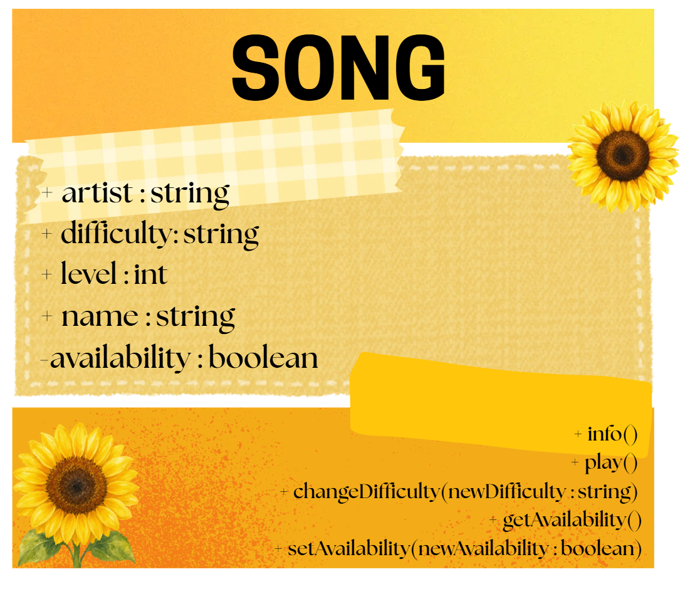
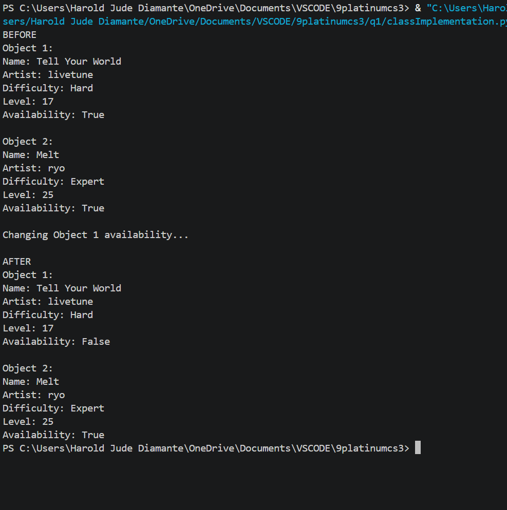
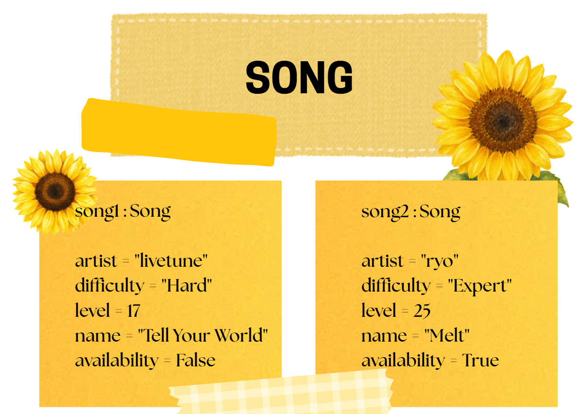

# Class Attributes and Methods

## Previous Design

Link to my previous activity:
[classObjectUML.md](q1/classObjectUML.md)

## Design Revision

Changes from my previous design:

* I changed `availability` from a public attribute to a private attribute.
* I added methods to safely view and change the availability of a song.

## Visibility Decisions

| Attribute | Data Type | Visibility | Reason |
| ------------ | -------- | ----------------- |-----------|
| artist | string | Public | The artist is basic info about the song. |
| difficulty | string | Public | The difficulty is general information about the song |
| level | int | Public | The level is basic information that describes the song's difficulty. |
| name | string | Public | The name identifies the song. |
| availability | boolean | Private | Availability should only contain `True` or `False`, so it should be changed through a method to prevent invalid values. |

## Updated UML Class Diagram

## Python Implementation

class Song:
    def __init__(self, artist, difficulty, level, name, availability):
        self.artist = artist
        self.difficulty = difficulty
        self.level = level
        self.name = name
        self.__availability = availability

    def info(self):
        print("Name:", self.name)
        print("Artist:", self.artist)
        print("Difficulty:", self.difficulty)
        print("Level:", self.level)
        print("Availability:", self.__availability)

    def play(self):
        if self.__availability:
            print("Now playing:", self.name)
        else:
            print(self.name, "is currently unavailable.")

    def changeDifficulty(self, newDifficulty):
        self.difficulty = newDifficulty

    def getAvailability(self):
        return self.__availability

    def setAvailability(self, newAvailability):
        if isinstance(newAvailability, bool):
            self.__availability = newAvailability

song1 = Song("livetune", "Hard", 17, "Tell Your World", True)
song2 = Song("ryo", "Expert", 25, "Melt", True)

print("BEFORE")

print("Object 1:")
song1.info()

print()

print("Object 2:")
song2.info()

print("\nChanging Object 1 availability...")
song1.setAvailability(False)

print("\nAFTER")

print("Object 1:")
song1.info()

print()

print("Object 2:")
song2.info()

## Test Run

## Object Diagram

## Analysis

### Why did you make your chosen attribute private?

I made availability private because it should only contain a boolean value of `True` or `False`. If other parts of the program changed it directly, an incorrect value could be assigned. Making it private allows the class to control changes through the setAvailability() method.

### Which method changes the state of your object?

The setAvailability() method changes the state of a Song object. It changes the private availability attribute using the value given as a parameter. In my test, I used this method to change the availability of the first song from `True` to `False`.

### How did your two objects demonstrate that instances are independent?

I created two different objects called song1 and song2 using the same Song class. I changed the availability of song1 to `False`, but the availability of song2 remained `True`. This shows that each object stores its own values and changing one object does not automatically affect another object.

### What is the difference between your class diagram and your object diagram?

The class diagram shows the general blueprint of the `Song` class, including its attributes, data types, and methods. The object diagram shows the actual values stored in the two Song objects after the program runs. For example, the class diagram shows `name : string`, while the object diagram shows actual song names such as `Tell Your World` and `Melt`.
