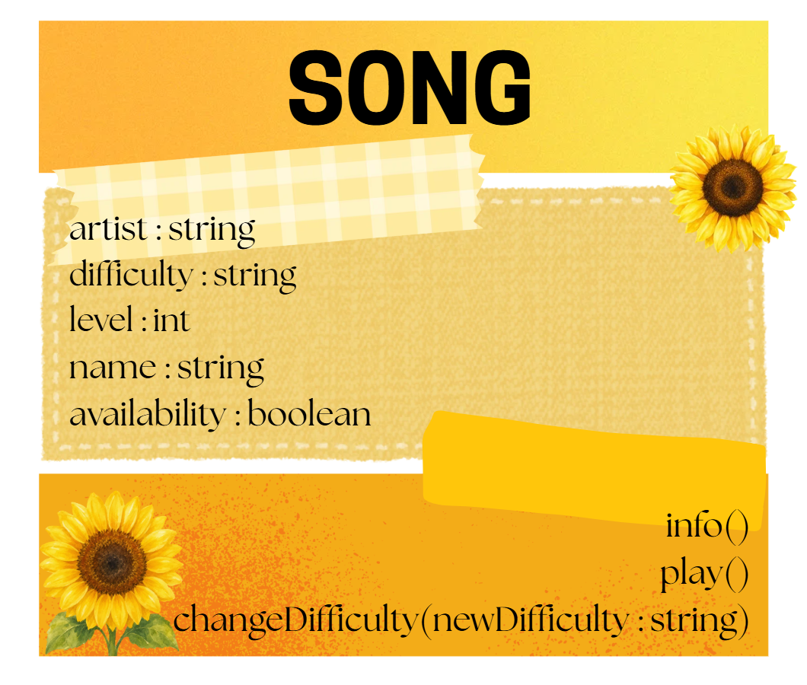

# SG4 - Understanding Classes and Objects
## Class Name
Song 
## Class Description
a song/musical chart, that can be played in PROJECT SEKAI: COLORFUL STAGE! (rhythm game)
## Properties
| Property | Data Type | Description |
| -|-| - |
| Artist | string | The artist/creator of the song |
| Difficulty | string | General difficulty of the song (Easy, Normal, Hard, Expert, Master, Append |
| Level | int | A numerical value of the difficulty (5 - 38) |
| Name  | string | Name of the song |
| Availability  | boolean | Indicates if the song is ingame |
## Methods
| Method | Description |
| - | - |
| Info | Prints all the provided properties | 
| ChangeDifficulty(newDifficulty) | Changes the song difficulty to the provided difficulty | 
| Play | prints a message that indicates the song is playing | 
## Class Diagram

## Design Explanation
### Why did you choose this class? 
The context is from my favorite game, and it feels more like myself if i picked this class.
### Which property is the most important? Why?
For me, probably the name. Its the only string that makes every song different.
### Which method is the most useful? Why? 
Info, because it provides the user a short description of the song they added, making the class like a library of songs that the user can look at.
